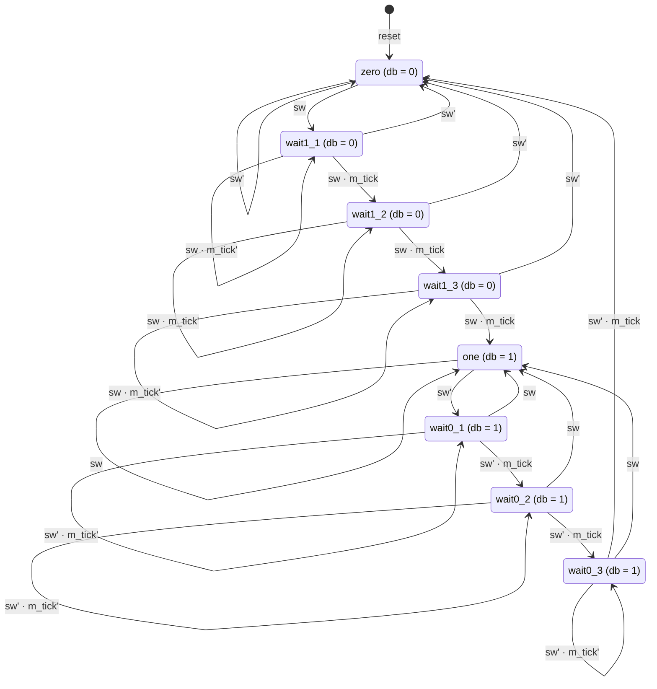

# Especificación del Debouncer FSM (db_fsm)

Fecha: 8 de octubre de 2026 · Autor: Miguel · Grupo de verificación

---

## Antecedentes: qué es un debouncer y para qué sirve

Un debouncer es un circuito que convierte la señal ruidosa de un interruptor mecánico en una señal limpia, con un solo cambio por cada pulsación real.

**El problema: el rebote mecánico.** Los botones y switches deslizables tienen contactos metálicos que, al cerrarse o abrirse, chocan y se separan varias veces antes de quedar firmes. Durante ese tiempo la señal oscila entre 0 y 1; en switches típicos el rebote se asienta en menos de 20 ms.

**Por qué importa en un sistema digital.** Un humano percibe una sola pulsación, pero el circuito trabaja a 50 MHz (un ciclo cada 20 ns) y ve cada rebote como una transición válida. Sin filtrar, un contador avanzaría varias veces por pulsación, una FSM saltaría estados o un detector de flanco generaría varios pulsos.

**La función del debouncer:**

- Ignorar los cambios de corta duración (glitches) en la entrada.
- Cambiar la salida solo cuando la entrada se mantuvo estable en el nuevo valor durante un tiempo mínimo (aquí, 20 ms o más).
- Entregar una señal síncrona al reloj, apta para lógica posterior como detectores de flanco, contadores o FSM de control.

**Formas de implementarlo.** El rebote se puede filtrar en hardware analógico (red RC más Schmitt trigger), en software (lecturas periódicas en un microcontrolador) o en lógica digital. Este documento cubre la versión digital basada en un timer y una FSM; el costo de esta solución es una latencia de 20 a 30 ms entre la pulsación y la salida, imperceptible para una persona.

## 1. Propósito y alcance

El DUT `db_fsm` entrega en `db` una versión estable de la señal mecánica `sw`: solo cambia cuando `sw` permanece en el nuevo valor durante tres ticks consecutivos del timer de 10 ms (entre 20 y 30 ms).

- **Fuente de referencia:** P. Chu, *FPGA Prototyping by Verilog/VHDL Examples*, sección 5.3.3 (Figura 5.8, Figura 5.9, Listing 5.6), esquema 1: salida retardada.
- **Dentro del alcance:** timer libre de 10 ms, FSM de 8 estados, puerto `db`, comportamiento de reset y latencias.
- **Fuera del alcance:** el esquema 2 (salida inmediata, Experimento 5.5.2), el esquema FSMD de la sección 6.2.1 y el detector de flancos que suele seguir al debouncer.
- **Rol del equipo:** grupo de verificación; este documento es la referencia contra la que se construyen el modelo de referencia, las aserciones y la cobertura.

## 2. Interfaz

El módulo tiene tres entradas y una salida; todo es síncrono a `clk` salvo `reset`, que es asíncrono y activo en alto.

| Puerto | Dir. | Ancho | Descripción |
| --- | --- | --- | --- |
| `clk` | in | 1 | Reloj del sistema, flanco de subida. Referencia: 50 MHz (periodo 20 ns). |
| `reset` | in | 1 | Reset asíncrono, activo en alto. Lleva la FSM a `zero` y el contador a 0. |
| `sw` | in | 1 | Entrada cruda del switch/botón, con rebotes. |
| `db` | out | 1 | Salida filtrada (debounced). Salida Moore, depende solo del estado. |

| Parámetro | Valor de referencia | Descripción |
| --- | --- | --- |
| `N` | 19 | Bits del contador del timer. Periodo del tick = 2^N ciclos. |
| `T_tick` | 2^19 × 20 ns ≈ 10.49 ms | Periodo de `m_tick` con reloj de 50 MHz. |
| `N` en simulación | 3 a 5 (propuesto) | Valor reducido para simular en tiempos razonables; ver sección 7. |

`m_tick` es una señal interna (no es puerto), pero el testbench la observa por referencia jerárquica o mediante un puerto de depuración.

## 3. Arquitectura

El DUT son dos bloques: un timer libre que genera `m_tick` y una FSM Moore de 8 estados que cuenta ticks mientras `sw` se mantiene.

**Timer (free-running):**

- Contador `q_reg` de N bits que incrementa en cada ciclo de `clk` y da la vuelta (wrap-around) al llegar a 2^N − 1.
- `m_tick = 1` cuando `q_reg == 0`; dura exactamente un ciclo de reloj y se repite cada 2^N ciclos.
- El timer no se reinicia cuando cambia `sw`; por eso el primer tick después de un cambio llega en cualquier momento entre 1 y 2^N ciclos.

**FSM:**

- Estados estables: `zero` (`db = 0`) y `one` (`db = 1`).
- Estados de espera hacia 1: `wait1_1`, `wait1_2`, `wait1_3` (`db = 0`).
- Estados de espera hacia 0: `wait0_1`, `wait0_2`, `wait0_3` (`db = 1`).
- Registro de estado con reset asíncrono; lógica de siguiente estado combinacional; `db` decodificado del estado (Moore).

## 4. Diagrama de estados

Las transiciones coinciden con la Figura 5.9 del libro. `tick` = `m_tick = 1` con `sw` en el nuevo valor; sin tick, cada estado de espera permanece.



La ruta exterior (zero → wait1_1 → wait1_2 → wait1_3 → one → wait0_1 → wait0_2 → wait0_3 → zero) es el cambio de `db`; las transiciones de regreso (`waitX_k` → estado estable) son los rebotes que regresan al estado estable sin tocar la salida.

## 5. Requerimientos funcionales

Cada requerimiento tiene un ID para trazarlo a una aserción, un checker del scoreboard o un punto de cobertura. T = 2^N ciclos de reloj.

| ID | Requerimiento | Cómo se verifica |
| --- | --- | --- |
| REQ-01 | Con `reset = 1`, la FSM pasa a `zero`, `db = 0` y `q_reg = 0`, sin esperar flanco de reloj. | Aserción asíncrona + prueba de reset a mitad de operación. |
| REQ-02 | `db = 0` en `zero`, `wait1_1`, `wait1_2`, `wait1_3`; `db = 1` en `one`, `wait0_1`, `wait0_2`, `wait0_3`. | Aserción sobre el estado. |
| REQ-03 | En `zero`: si `sw = 1`, siguiente estado `wait1_1`; si no, permanece. | Aserción de transición. |
| REQ-04 | En `wait1_k`: si `sw = 0`, regresa a `zero` (tiene prioridad sobre `m_tick`); si `sw = 1` y `m_tick = 1`, avanza (`wait1_2`, `wait1_3`, `one`); si no, permanece. | Aserciones de transición + cobertura del caso `sw = 0` y `m_tick = 1` simultáneos. |
| REQ-05 | En `one`: si `sw = 0`, siguiente estado `wait0_1`; si no, permanece. | Aserción de transición. |
| REQ-06 | En `wait0_k`: si `sw = 1`, regresa a `one` (prioridad sobre `m_tick`); si `sw = 0` y `m_tick = 1`, avanza (`wait0_2`, `wait0_3`, `zero`); si no, permanece. | Aserciones de transición + cobertura de prioridad. |
| REQ-07 | `m_tick` vale 1 durante exactamente un ciclo cada T ciclos, sin depender de `sw`. | Aserción de periodo y ancho. |
| REQ-08 | `db` solo cambia en el flanco siguiente a un ciclo con `m_tick = 1`. | Aserción: `$changed(db) \|-> $past(m_tick)`. |
| REQ-09 | Un pulso o rebote de `sw` que dura menos de 2T + 1 ciclos nunca cambia `db`. | Escenarios de rebote + modelo de referencia. |
| REQ-10 | Si `sw` se mantiene en un valor v durante 3T + 1 ciclos o más, `db` termina en v. | Aserción de vivacidad acotada + modelo. |
| REQ-11 | Una vez que `db` cambia, se mantiene al menos 2T + 1 ciclos. | Aserción de ancho mínimo de pulso de `db`. |
| REQ-12 | `db` no presenta glitches: es salida Moore decodificada de un registro. | Revisión de RTL + aserción a nivel de ciclo. |

## 6. Requerimientos temporales

La latencia de `db` depende de la fase del timer libre: con N = 19 y 50 MHz va de unos 21 ms a 31.5 ms, no de un valor fijo.

Sea e0 el primer flanco de reloj en que la FSM muestrea el nuevo valor de `sw` (sale de `zero` o de `one`). Para que `db` cambie hacen falta tres ticks dentro de los estados de espera:

- **Mejor caso:** el primer tick cae en el ciclo justo después de e0. `db` cambia en el flanco e0 + 2T + 1.
- **Peor caso:** el tick acaba de pasar en el ciclo de e0. `db` cambia en el flanco e0 + 3T.
- **Condición:** `sw` debe conservar el nuevo valor en todos los flancos desde e0 hasta el cambio de `db`; si vuelve atrás, la FSM regresa al estado estable y `db` no cambia.

| Magnitud | Ciclos | Tiempo (N = 19, 50 MHz) | Tiempo (N = 4, sim) |
| --- | --- | --- | --- |
| Periodo de `m_tick` (T) | 2^N | 10.49 ms | 16 ciclos |
| Latencia mínima de `db` | 2T + 1 | ≈ 20.97 ms | 33 ciclos |
| Latencia máxima de `db` | 3T | ≈ 31.46 ms | 48 ciclos |
| Pulso de `sw` que siempre se filtra | ≤ 2T | ≤ 20.97 ms | ≤ 32 ciclos |
| Ancho mínimo de pulso en `db` | 2T + 1 | ≈ 20.97 ms | 33 ciclos |

Valores confirmados en simulación con N = 4 (Icarus Verilog) barriendo las 16 fases del timer: latencia mínima 33 y máxima 48 ciclos; pulsos de 2T ciclos se filtran siempre y pulsos de 3T + 1 ciclos pasan siempre. Los estados y transiciones coinciden con la Figura 5.9 del libro.

## 7. Supuestos y observaciones del equipo de verificación

Antes de cerrar la especificación conviene acordar con diseño estos puntos, porque cambian lo que el testbench debe esperar.

**Supuestos:**

- `sw` llega síncrona a `clk` en simulación; el testbench la cambia lejos del flanco activo.
- Un solo dominio de reloj; no se verifican aspectos de metaestabilidad a nivel de compuerta.
- La FSM arranca en `zero` tras el reset, aunque el switch físico esté en 1 (en ese caso `db` sube a 1 entre 2T + 1 y 3T ciclos después).

**Observaciones para diseño (posibles hallazgos):**

1. **Sin sincronizador en `sw`.** El Listing 5.6 usa `sw` directo en la lógica de siguiente estado. Proponemos agregar dos flip-flops de sincronización; añadirían 2 ciclos de latencia, que se reflejan en la sección 6.
2. **N como `localparam`.** Con N = 19 cada cambio de `db` cuesta más de un millón de ciclos simulados. Pedimos declarar N como `parameter` para simular con N = 3 a 5 y correr una regresión final con N = 19.
3. **`m_tick` interno.** Pedimos exponerlo como puerto de depuración o aceptar referencias jerárquicas desde el testbench.
4. **Latencia no determinista.** Como el timer no se reinicia con `sw`, la especificación acepta cualquier latencia en [2T + 1, 3T]; el scoreboard no debe esperar un ciclo exacto salvo que use un modelo ciclo a ciclo.
5. **Codificación de estados.** Con 8 estados en 3 bits no hay estados ilegales, pero el `default` del `case` debe ir a `zero`.

**Preguntas abiertas:**

- [ ] ¿Lenguaje del DUT y del testbench: Verilog, VHDL o SystemVerilog con UVM?
- [ ] ¿Frecuencia de reloj de la tarjeta objetivo (50 MHz o 100 MHz)? Cambia el N necesario para 10 ms.
- [ ] ¿Se acepta el sincronizador de la observación 1 dentro del DUT?

## 8. Escenarios de prueba y cobertura

La verificación se da por cerrada cuando los escenarios dirigidos pasan, las 22 transiciones de la FSM están cubiertas y no falla ninguna aserción.

| Escenario | Estímulo en `sw` | Resultado esperado | REQ |
| --- | --- | --- | --- |
| S1 Reset | `reset` en distintos estados y fases del timer | `zero`, `db = 0`, `q_reg = 0` | 01 |
| S2 Pulsación limpia | 0 → 1 estable, luego 1 → 0 estable | `db` sigue con latencia en [2T + 1, 3T] | 03–06, 10 |
| S3 Rebote corto | Ráfaga de pulsos < T antes de estabilizar | `db` cambia una sola vez | 09 |
| S4 Pulso en el límite | Pulsos de 2T y de 2T + 2 ciclos | 2T se filtra; 2T + 2 puede pasar según la fase | 09, 10 |
| S5 Fase del timer | Mismo cambio de `sw` en cada fase de `q_reg` (barrido 0..T−1) | Latencias mínima y máxima alcanzadas | 06 |
| S6 Prioridad | `sw` regresa justo en el ciclo de `m_tick` en cada `waitX_k` | Regresa al estado estable, no avanza | 04, 06 |
| S7 Aleatorio | Rebotes aleatorios con duración y número de pulsos acotados | Coincide con el modelo de referencia | 08, 11, 12 |
| S8 Arranque con switch en 1 | `sw = 1` durante y después del reset | `db` sube tras 2T + 1 a 3T ciclos | 01, 10 |

**Cobertura funcional mínima:**

- Todos los estados visitados (8 bins).
- Las 22 transiciones: 8 auto-lazos (permanecer), 8 avances por tick (incluye `zero→wait1_1` y `one→wait0_1`, que no dependen del tick) y 6 regresos (`wait1_k→zero`, `wait0_k→one`).
- Cruce de `waitX_k` × (`sw` regresa, `m_tick`) para cubrir la prioridad.
- Latencia de `db` en los bins mínima, intermedia y máxima.
- Longitud de pulso de `sw`: < T, [T, 2T], (2T, 3T], > 3T.

## Anexo A. Circuito a verificar (RTL de referencia, `db_fsm.v`)

Basado en el Listing 5.6 de Chu, con los cambios propuestos por el grupo de verificación: `N` como `parameter`, `m_tick` expuesto como puerto de depuración y nombres de estados iguales a los de esta especificación.

```verilog
// ============================================================================
// db_fsm.v  -  Debouncer basado en FSM (esquema 1: salida retardada)
// Referencia: P. Chu, "FPGA Prototyping by Verilog Examples", sec. 5.3.3,
//             Fig. 5.9 / Listing 5.6.
//
// Cambios respecto al libro (propuestos por el grupo de verificacion):
//   - N es `parameter` (no localparam) para poder simular con N pequeno.
//   - m_tick se expone como puerto de depuracion.
//   - Estados con nombres de la especificacion (wait1_1 ... wait0_3).
//
// Con clk = 50 MHz y N = 19:  T = 2^19 * 20 ns ~= 10.49 ms
// Latencia de db tras un cambio estable de sw: [2T+1, 3T] ciclos.
// ============================================================================
module db_fsm
  #(
    parameter N = 19                 // bits del timer; periodo de tick = 2^N
  )
  (
    input  wire clk,
    input  wire reset,               // asincrono, activo en alto
    input  wire sw,                  // entrada cruda del switch (con rebotes)
    output reg  db,                  // salida filtrada
    output wire m_tick               // depuracion: tick de 10 ms
  );

  // --------------------------------------------------------------------------
  // Codificacion de estados (8 estados -> 3 bits, sin estados ilegales)
  // --------------------------------------------------------------------------
  localparam [2:0]
    ZERO    = 3'b000,
    WAIT1_1 = 3'b001,
    WAIT1_2 = 3'b010,
    WAIT1_3 = 3'b011,
    ONE     = 3'b100,
    WAIT0_1 = 3'b101,
    WAIT0_2 = 3'b110,
    WAIT0_3 = 3'b111;

  reg [N-1:0] q_reg;
  wire [N-1:0] q_next;
  reg [2:0]   state_reg, state_next;

  // --------------------------------------------------------------------------
  // Timer libre: cuenta 0 .. 2^N-1 y da la vuelta; m_tick cuando q_reg == 0
  // --------------------------------------------------------------------------
  always @(posedge clk, posedge reset)
    if (reset)
      q_reg <= {N{1'b0}};
    else
      q_reg <= q_next;

  assign q_next = q_reg + 1'b1;
  assign m_tick = (q_reg == {N{1'b0}});

  // --------------------------------------------------------------------------
  // Registro de estado
  // --------------------------------------------------------------------------
  always @(posedge clk, posedge reset)
    if (reset)
      state_reg <= ZERO;
    else
      state_reg <= state_next;

  // --------------------------------------------------------------------------
  // Logica de siguiente estado y salida (Moore)
  //   - En los estados de espera, el regreso por sw tiene prioridad sobre m_tick
  // --------------------------------------------------------------------------
  always @* begin
    state_next = state_reg;          // por defecto: permanece
    db         = 1'b0;
    case (state_reg)
      ZERO: begin
        db = 1'b0;
        if (sw)
          state_next = WAIT1_1;
      end
      WAIT1_1: begin
        db = 1'b0;
        if (~sw)
          state_next = ZERO;
        else if (m_tick)
          state_next = WAIT1_2;
      end
      WAIT1_2: begin
        db = 1'b0;
        if (~sw)
          state_next = ZERO;
        else if (m_tick)
          state_next = WAIT1_3;
      end
      WAIT1_3: begin
        db = 1'b0;
        if (~sw)
          state_next = ZERO;
        else if (m_tick)
          state_next = ONE;
      end
      ONE: begin
        db = 1'b1;
        if (~sw)
          state_next = WAIT0_1;
      end
      WAIT0_1: begin
        db = 1'b1;
        if (sw)
          state_next = ONE;
        else if (m_tick)
          state_next = WAIT0_2;
      end
      WAIT0_2: begin
        db = 1'b1;
        if (sw)
          state_next = ONE;
        else if (m_tick)
          state_next = WAIT0_3;
      end
      WAIT0_3: begin
        db = 1'b1;
        if (sw)
          state_next = ONE;
        else if (m_tick)
          state_next = ZERO;
      end
      default: begin
        db         = 1'b0;
        state_next = ZERO;
      end
    endcase
  end

endmodule
```
